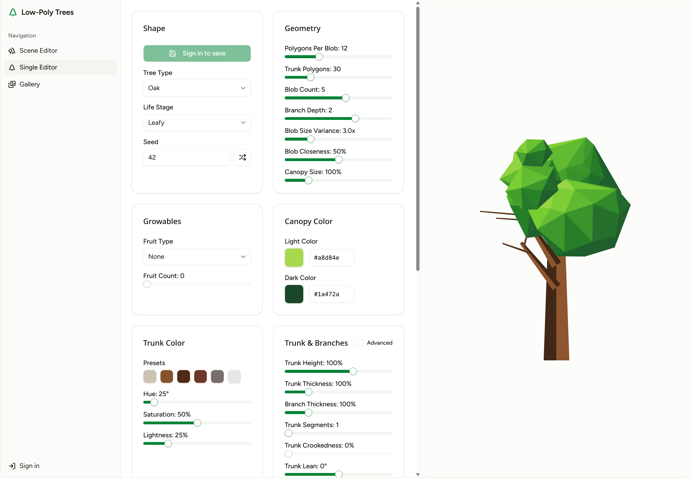

# Low-Poly 2D Trees

<!-- Tree editor screenshot -->



A procedural **low-poly tree generator and visual editor** — companion project for [Grovekeeper](https://github.com/MartinoPolo/grovekeeper). Design customizable polygon-based trees of multiple shapes across lifecycle stages, save them to a gallery, and compose multi-tree scenes.

## Features

- **Tree Editor** — 30+ parameters: shape, canopy geometry, branch depth, trunk structure, fruit, colors
- **Tree shapes** — oak, pine, birch, fir, maple, willow, cypress, apple, cherry, bush, baobab, acacia, custom
- **Lifecycle stages** — seed → sprouting → sapling → growing → leafy → flowering → fruiting → autumn → ready → bare → dead → stump
- **Animations** — canopy sway, growth oscillation, falling leaves, tool idle animations
- **Environment effects** — rain, snow, lightning, fireflies, wind particles, sun rays, clouds
- **Overlays** — glow, speech bubble, storm cloud, wilting effect
- **Scene Editor** — multi-tree composition with depth layering and stage selector
- **Gallery** — save, rename, and reload named tree configurations
- **Stage Showcase** — all lifecycle stages side by side
- **Auth** — email/password, Google OAuth, GitHub OAuth, Passkeys
- **i18n** — English and Czech

## Library Usage

This project doubles as a **Svelte component library** consumed by [Grovekeeper](https://github.com/MartinoPolo/grovekeeper). The public API is defined in `src/lib/index.ts` — everything else is internal.

### Install

```sh
# from Grovekeeper or any SvelteKit 2 project
pnpm add low-poly-2d-trees
```

Peer dependency: `svelte ^5.0.0`

### Quick Start

```svelte
<script>
	import {
		LowPolyTree,
		PottedPlant,
		generateTree,
		DEFAULT_TREE_CONFIG,
		OVERLAY_DEFAULTS,
	} from 'low-poly-2d-trees';
</script>

<!-- Render a tree with default config -->
<LowPolyTree />

<!-- Render with custom config -->
<LowPolyTree
	config={{ ...DEFAULT_TREE_CONFIG, shape: 'oak', stage: 'leafy', seed: 42 }}
	animateGrowth
	animateCanopySway
	onanchors={(anchors) => console.log(anchors)}
/>

<!-- Render a potted plant -->
<PottedPlant stage="sprouting" seed={7} />
```

### Components

| Component     | Description                                                                                  |
| ------------- | -------------------------------------------------------------------------------------------- |
| `LowPolyTree` | Full tree renderer with canopy, trunk, branches, fruit, tools, overlays, and ground elements |
| `PottedPlant` | Simplified potted-plant renderer                                                             |

#### `<LowPolyTree>` Props

| Prop                | Type                             | Default               | Description                                           |
| ------------------- | -------------------------------- | --------------------- | ----------------------------------------------------- |
| `config`            | `TreeConfig`                     | `DEFAULT_TREE_CONFIG` | Master configuration (shape, stage, colors, geometry) |
| `showCanopy`        | `boolean`                        | `true`                | Toggle canopy visibility                              |
| `showBranches`      | `boolean`                        | `true`                | Toggle branch visibility                              |
| `showTrunk`         | `boolean`                        | `true`                | Toggle trunk visibility                               |
| `showFruit`         | `boolean`                        | `true`                | Toggle fruit visibility                               |
| `animateGrowth`     | `boolean`                        | `false`               | Animate seed→full growth on mount                     |
| `animateCanopySway` | `boolean`                        | `false`               | Idle canopy sway animation                            |
| `animateBranches`   | `boolean`                        | `false`               | Branch animation                                      |
| `growthVariance`    | `number`                         | `50`                  | Randomness in growth animation timing                 |
| `toolVisibility`    | `ToolVisibility`                 | —                     | Which tools to show (axe, shovel, etc.)               |
| `overlayConfig`     | `OverlayConfig`                  | `OVERLAY_DEFAULTS`    | Glow, speech bubble, storm cloud config               |
| `groundElements`    | `number`                         | —                     | Number of ground decorations                          |
| `disabled`          | `boolean`                        | `false`               | Disable interactions                                  |
| `class`             | `string`                         | —                     | CSS class passthrough                                 |
| `onanchors`         | `(anchors: TreeAnchors) => void` | —                     | Callback with computed anchor positions               |

#### `<PottedPlant>` Props

| Prop               | Type               | Default     | Description            |
| ------------------ | ------------------ | ----------- | ---------------------- |
| `stage`            | `PottedPlantStage` | from config | Plant lifecycle stage  |
| `seed`             | `number`           | from config | PRNG seed for geometry |
| `canopyLightColor` | `string`           | —           | Light canopy hex color |
| `canopyDarkColor`  | `string`           | —           | Dark canopy hex color  |
| `class`            | `string`           | —           | CSS class passthrough  |

### Generators

For headless / server-side tree generation without rendering:

```ts
import { generateTree, generatePottedPlant, DEFAULT_TREE_CONFIG } from 'low-poly-2d-trees';
import type { TreeGeometry } from 'low-poly-2d-trees';

const geometry: TreeGeometry = generateTree({
	...DEFAULT_TREE_CONFIG,
	shape: 'pine',
	stage: 'leafy',
	seed: 123,
});
// geometry.trunkQuads, geometry.canopyBlobs, geometry.anchors, ...
```

### Public API Reference

The barrel file (`src/lib/index.ts`) exports everything a consumer needs, grouped by domain:

| Category            | Key Exports                                                                                                      |
| ------------------- | ---------------------------------------------------------------------------------------------------------------- |
| **Components**      | `LowPolyTree`, `PottedPlant`                                                                                     |
| **Generators**      | `generateTree`, `generatePottedPlant`                                                                            |
| **Tree Config**     | `TreeConfig`, `DEFAULT_TREE_CONFIG`, `VIEWBOX_WIDTH`, `VIEWBOX_HEIGHT`                                           |
| **Shapes**          | `TREE_SHAPES`, `TreeShape`, `TREE_SHAPE_OPTIONS`, `isTreeShape`, `isEvergreen`                                   |
| **Stages**          | `TREE_STAGES`, `TreeStage`, `TREE_STAGE_OPTIONS`, `isTreeStage`                                                  |
| **Shape Defaults**  | `SHAPE_DEFAULTS` — per-shape config presets                                                                      |
| **Config Enums**    | `CROOKEDNESS_MODES`, `CrookednessMode`, `BRANCH_MIRRORING`, `BranchMirroring`                                    |
| **Fruit**           | `FRUIT_TYPES`, `FruitType`, `FRUIT_TYPE_OPTIONS`, `SHAPE_FRUIT_MAP`, `isFruitType`                               |
| **Custom Blobs**    | `CustomBlob`, `CUSTOM_BLOB_DEFAULT`, `CUSTOM_BLOB_BOUNDARY_KINDS` + size/position constants                      |
| **Core Geometry**   | `Point2D`, `Triangle`, `Quad`, `TreeAnchors`, `TreeGeometry`, `BlobGeometry`, `BranchGeometry`, etc.             |
| **Z-Ordering**      | `Z_ORDER_LAYERS`, `ZOrderLayer`, `splitRootBranchesByZOrder`, `splitCanopyBlobsByZOrder`                         |
| **Tools**           | `TOOL_TYPES`, `ToolType`, `TOOL_DEFINITIONS`, `ToolVisibility`, `createDefaultToolVisibility`, `TOOL_ANIMATIONS` |
| **Overlays**        | `GlowConfig`, `GLOW_LIMITS`, `OverlayConfig`, `OVERLAY_DEFAULTS`, `hasActiveOverlay`                             |
| **Ground**          | `GROUND_LIMITS`                                                                                                  |
| **Animation**       | `GROWTH_DURATION_SECONDS`, `computeAnimationDelay`, `computeGrowthScales`                                        |
| **Potted Plants**   | `POTTED_PLANT_STAGES`, `PottedPlantStage`, `PottedPlantConfig`, `DEFAULT_POTTED_PLANT_CONFIG`                    |
| **Color**           | `HslColor`, `hexToHsl`, `hslToHex`, `interpolateHslInHexSpace`, `clamp`                                          |
| **Disabled Params** | `DISABLED_PARAMS_BY_SHAPE`, `isParamDisabled` — which config params are irrelevant per shape                     |

### Building the Package

```sh
pnpm package    # runs svelte-package → outputs to ./dist
```

## Stack

| Layer      | Technology                     |
| ---------- | ------------------------------ |
| Framework  | SvelteKit 2 + Svelte 5 (runes) |
| Language   | TypeScript (strict)            |
| Styling    | Tailwind CSS 4 + shadcn-svelte |
| Database   | PostgreSQL + Drizzle ORM       |
| Auth       | BetterAuth                     |
| i18n       | Paraglide JS                   |
| Deployment | Cloudflare Pages               |

## Install

```sh
pnpm install
cp .env.example .env   # set DATABASE_URL and AUTH_SECRET
pnpm db:start      # requires Docker
pnpm db:push
pnpm dev
```

## Environment Variables

| Variable               | Required | Description                  |
| ---------------------- | -------- | ---------------------------- |
| `DATABASE_URL`         | Yes      | PostgreSQL connection string |
| `AUTH_SECRET`          | Yes      | `openssl rand -base64 32`    |
| `GOOGLE_CLIENT_ID`     | No       | Google OAuth                 |
| `GOOGLE_CLIENT_SECRET` | No       | Google OAuth                 |
| `GITHUB_CLIENT_ID`     | No       | GitHub OAuth                 |
| `GITHUB_CLIENT_SECRET` | No       | GitHub OAuth                 |

## Scripts

```sh
pnpm dev          # dev server
pnpm typecheck        # typecheck + sveltecheck
pnpm check:fast   # prettier + oxlint (pre-commit tier)
pnpm check:fallow # dead-code regression gate
pnpm check:all    # format + lint + fallow + typecheck + eslint
pnpm test         # unit tests
pnpm test:e2e     # E2E tests
pnpm db:studio    # Drizzle Studio GUI
```
